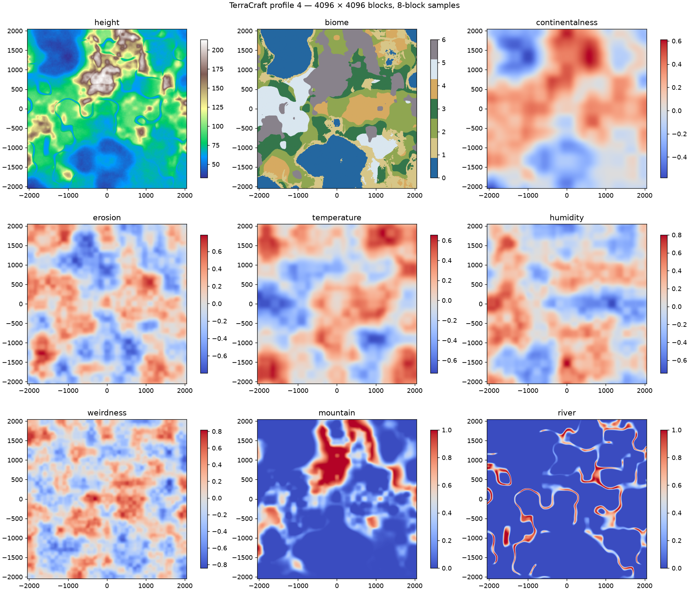
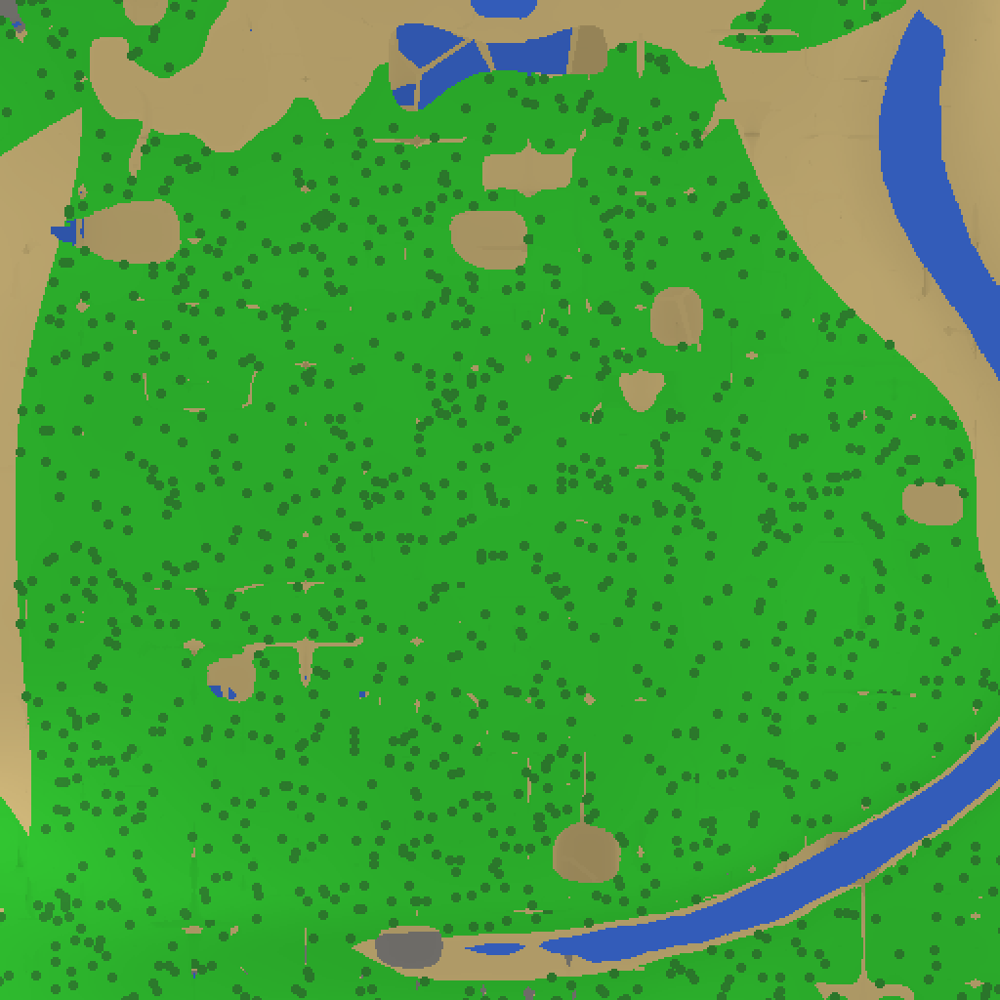
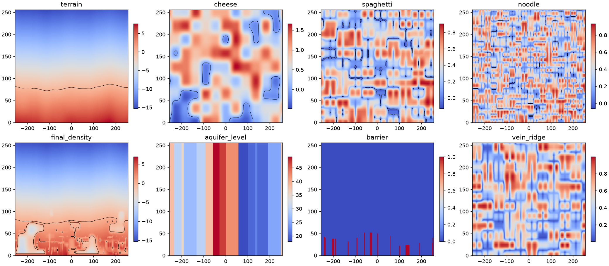

# World generation, profile 4

Profile 4 replaces the runtime terrain pipeline for **new worlds**. Worlds
saved with profiles 1, 2 or 3 continue using their original generator,
including unvisited chunks. Existing chunk files still take precedence over
generation. Create a new world to see this rewrite; no save migration is
performed.

## Reference and accuracy

The reference is the **Java Edition 26.3 release**, checked on 2026-10-08.
The official launcher manifest identified 26.3 as the current release;
26.4-snapshot-3 was the current snapshot and was not used as the target.

The [official 26.3 technical notes](https://feedback.minecraft.net/hc/en-us/articles/48913133328013-Minecraft-Java-Edition-26-3)
describe the material-rule replacement for surface rules, configurable
aquifer fields including exclusion, and the dedicated ore-vein material
rule. Minecraft's [world-generation overview](https://www.minecraft.net/en-us/article/new-world-generation-java-available-testing)
also explains the terrain/climate relationship and distinct noise caves.

Numerical ore ranges were read from **data JSON**, not decompiled code:

- [Official launcher manifest](https://piston-meta.mojang.com/mc/game/version_manifest_v2.json).
- The version manifest's [26.3 client archive](https://piston-data.mojang.com/v1/objects/e877b6a07acd633fb3bb475002175cec036e7b87/client.jar),
  SHA-1 `e877b6a07acd633fb3bb475002175cec036e7b87`.
- `data/minecraft/worldgen/noise_settings/overworld.json`.
- `data/minecraft/worldgen/placed_feature/ore_*.json` and
  `data/minecraft/worldgen/feature/ore_*.json`.
- `data/minecraft/worldgen/material_rule/overworld/*_ore_vein.json` and
  `data/minecraft/worldgen/density_function/overworld/ore_vein/*.json`.

Research downloads remain in ignored `build/worldgen-research/`. No client
archive, Minecraft assets, or proprietary source code is committed.

This is an original C implementation of the important relationships, **not
Java seed compatibility or full Minecraft parity**. The noise implementation,
random streams, biome set, surface predicates, and feature geometry differ.

## Audit of the replaced generator

| System | Previous behavior | Profile 4 behavior |
| --- | --- | --- |
| Chunk creation | Saved chunks first, then column fill | Same persistence contract, separate density pipeline |
| Terrain | Profiles 1–3 used layered 2D heights; profile 3 added warped ridges and rivers | Continental shelf/coast spline, erosion-dependent mountains, regional relief, warped valleys, local detail and volumetric density |
| Noise | Quintic interpolated value noise and normalized fBm | Deterministic salted fields, cached world-aligned 3D lattice, nonlinear density composition |
| Biomes | Separate temperature/humidity and mountain fields; elevation could override geography | Shared continentalness, erosion, temperature, humidity, weirdness and mountain strength |
| Caves | Chamber threshold plus one thin zero band; carving stopped four blocks below the surface | Chambers plus intersections of two tunnel fields at two scales; surface intersections allowed |
| Aquifers | None; all low columns filled to the global sea level | Local wet/dry cells, separate water levels, pressure barriers, deep lava pockets |
| Surfaces | Top block and three generic dirt/sand layers | Climate, slope, altitude, coastal depth and layered geology |
| Ores | All four ores restricted to Y≤32; same hash-cell lottery | Eight ores with separate height providers, feature budgets, exposure rules and large mineral networks |
| Spawn | First loaded column with two open blocks; could accept cave floors, tree tops or isolated ledges | Generate candidates, inspect actual terrain and a dry 5×5 neighborhood, then score suitable sites |
| Seed/order | Pure coordinate hashes already deterministic | Preserved; features include neighboring anchors rather than depending on loaded neighbors |

The old generator was coherent value noise, not independent random columns.
Its chief problems were missing relationships between systems, simplistic
cave/ore rules, and insufficient spawn validation. Legacy code remains
deliberately frozen for saved-world compatibility; it is not the new-world
generation path.

## Pipeline and mathematics

Implementation: `src/world/worldgen_v4.c`; integration:
`src/world/world_gen.c` and `src/game/session.c`.

### 1. Geography and climate

Independent salted, continuous fBm fields provide continentalness, erosion,
temperature, moisture and weirdness. Broad continentalness drives a smooth
cubic shelf/coast/inland spline. Erosion suppresses mountain strength;
weirdness shapes ridges inside those mountain regions. Regional relief and
small local detail have bounded amplitudes. Warped zero contours create
valley corridors, with wide transitions and weaker cuts in mountains.

Climate fields are sampled in world coordinates, never chosen per chunk.
Seven existing biome categories are supported: ocean, beach, plains, forest,
desert, snow and mountains. Vegetation uses the same climate classification
as the new terrain, rather than the old biome sampler.

### 2. Volumetric terrain and caves

The geographic elevation is an input to density, not the final solid/air
decision. Terrain density combines vertical depth and 3D shape noise, with
greater shape amplitude in mountains. Its intersection with cave density
determines the solid volume.

- Cheese fields form broad chambers, with stronger suppression near the
  surface.
- Spaghetti tunnels use `max(abs(a), abs(b)) - width`: the intersection of
  two signed fields forms winding tubes, rather than one sheet-like band.
- Noodles use a higher-frequency pair and a smaller width, enabled only in
  selected regions.
- A bottom fade protects the foundation. Surface entrances are intersections
  of those fields with terrain; there is no separate hole-stamping pass.

Eleven signed fields are cached on a **4×4×4** block lattice. Each field is
interpolated before `abs`, `min` or `max`; interpolating the already-combined
cave result would miss narrow crossings. Shared world lattice coordinates
and negative-coordinate floor division make chunk edges consistent.

### 3. Water and local aquifers

Sea level remains TerraCraft Y=64. Open basins and river channels receive
surface water. Underground cavities use nearest jittered local aquifer
centers on a 48-block horizontal grid. Floodedness and spread fields assign
wet/dry status and water tables. Different neighboring water tables receive
pressure walls near their shared boundary. Near-surface exclusion leaves
ordinary shallow caves dry. A separate field selects lava below Y=8.

Generated water uses the existing source/flow simulation. Lava is generated
as a static, non-collidable hazard with its own texture and self-lit surface;
player contact deals damage in Survival. Lava spreading, lava/water reactions,
and lighting nearby blocks are not implemented by this worldgen pass.

The aquifer cells are a horizontal adaptation, **not Java's complete 3D
aquifer-cell and pressure model**. They create local underground lakes and
dry regions without filling all caves to sea level.

### 4. Material rules

Only the highest exposed natural solid receives a surface layer; interior
caves do not get grass/dirt shells. Rules consider climate, altitude, slope
and coastal depth. Grass/snow receive dirt below them, beaches/deserts use
sand over sandstone, deep ocean floors use sand or gravel, and steep/high
terrain exposes stone. Deep rock is deepslate. Gravel participates in the
existing falling-block simulation.

### 5. Ores and veins

Ore features use deterministic world-coordinate anchors, individual height
providers and bounded paths with small lateral branches. Each feature has
a hard block budget. The anchor halo lets the same cluster cross a chunk
boundary regardless of generation order. Stone/deepslate are the host
materials; air-exposure rejection uses actual local blocks and the same
pure density sampler outside the chunk.

The reference bands below are **Java coordinates from 26.3 data**, before
TerraCraft's depth mapping:

| Ore | Reference height providers used |
| --- | --- |
| Coal | Triangular 0..192; uniform 136..top |
| Iron | Triangular −24..56 and 80..384; uniform bottom..72 |
| Copper | Triangular −16..112 |
| Gold | Triangular −64..32; lower uniform −64..−48 |
| Lapis | Triangular −32..32; buried uniform bottom..64 |
| Redstone | Uniform bottom..15; triangular bottom−32..bottom+32 |
| Diamond | Triangular bottom−80..bottom+80; uniform −64..−4; buried variant |
| Emerald | Triangular −16..480; mountain classification required |

Below the sea, `TerraY = floor(64 + (JavaY−63)/2)`; above it,
`TerraY = floor(JavaY+1)`. This compresses Java's deep mining space into the
existing 256-high storage. Features falling outside that storage are skipped.
Small branch offsets may extend a cluster a few blocks beyond its anchor
band. Counts and feature sizes come from the checked data, while cluster
geometry is original. Buried lapis/diamond variants reject exposed cells;
some coal, gold and diamond variants reject only part of air exposure.

Separate low-frequency vein-toggle and intersecting ridge fields create
larger deep iron/tuff and shallow copper/granite networks. Richness controls
ore versus filler and rare raw-ore blocks. No global per-block diamond
percentage is used.
Vein bands use the checked Java ranges −60..−8 for iron and 0..50 for
copper, mapped to TerraCraft depth. The documented edge attenuation, 0.08
ridge cutoff, 0.7 material density, richness derived from toggle magnitude,
filler-gap rule, and 2% raw-ore chance operate inside that coherent mask.

Java's badlands gold bonus, dripstone-biome copper bonus,
complete biome roster, and distinct deepslate textures for every
ore are not reproduced. The new ore blocks are mineable inventory items;
this pass does not add a furnace or new material recipes.

## Safe spawn selection

The generator never biases geography toward dry terrain around the origin.
Spawn selection runs after normal generation can be queried, before the
initial streaming window is centered.

1. Hash the seed into a fixed initial search origin.
2. Visit deterministic outward rings; cheaply reject unsuitable climate and
   elevation estimates.
3. Generate a 3×3 candidate neighborhood. Saved chunks are respected.
4. Evaluate multiple actual surface columns and score their flatness and
   elevation. Reject water/lava, trees, cave floors, steep neighbors, thin
   floors, blocked sky, and insufficient standing space.
5. Accept the best candidate within the first suitable neighborhood.
6. Release only newly generated rejected neighborhoods, keeping memory
   bounded and existing loaded chunks intact.
7. Store the spawn in metadata. Restored player positions are not moved.

The standing checks cover a dry 5×5 neighborhood, solid support below each
cell, and clear space to the sky. This exceeds the player's collision box.

Search is bounded at 128 rings. If no natural site is found, a separate,
deterministic 7×7 rescue clearing is persisted as an edit, and the API returns
1 so diagnostics can count it. This emergency fallback is tested explicitly;
it was **not used in the 500-seed normal-world run**. Allocation/storage
failure returns an error instead of inventing a position in midair.

## Determinism and versioning

There is no clock, global RNG, loaded-neighbor dependency or mutable noise
state in generation. Salted hashes and feature streams depend only on the
seed, world coordinates and frozen profile settings. The save writer keeps
profile 4 rather than clamping it back to profile 3. New material IDs are
appended after existing IDs; existing IDs are unchanged.
The application LAN handshake is version 3, so peers using the older block
registry are rejected rather than accepting updates they cannot render.
Use the same updated game build on both LAN machines.

The existing seed interface uses `long` and a 32-bit hash seed. On Windows,
numeric entry remains limited to the existing signed 32-bit seed range;
metadata's 64-bit field is not a claim of 64-bit generation entropy. Exact
floating-point equality across different compilers/platforms has not been
certified. Within the tested build, repeated seeds and reversed chunk order
produce identical block arrays.

## Debug tools and reproduction

From the repository root, using the existing configured Windows build:

```powershell
cmake --build build --config Release --target terracraft terracraft_tests worldgen_probe --parallel 4
build/Release/terracraft_tests.exe
build/Release/worldgen_probe.exe build/worldgen-sample 123456 500
python tools/plot_worldgen.py build/worldgen-sample
```

Use a distinct output prefix for each run; the probe replaces files with
that prefix. Plotting requires numpy, matplotlib and Pillow. No game window
or Minecraft installation is needed.

| Output | Contents |
| --- | --- |
| `-fields.csv` / `-atlas.png` | 4096×4096-block geographic/climate region, sampled every eight blocks |
| `-density.csv` / `-density.png` | Terrain, three cave families, final density, aquifer level/barriers and vein fields in a vertical section |
| `-section.ppm` / `-section.png` | Solid/air/fluid section |
| `-region.ppm` / `-region.png` | Actual generated 32×32 chunks viewed from above |
| `-materials.csv` | Actual block counts and 16-block height-band histograms |
| `-spawns.csv` | Seed, accepted coordinates, status and resident chunk count |

The probe generates and releases region chunks one at a time. Runtime
generation caches 3D fields, retains generated surface heights for vegetation,
and rejects impossible tree lotteries before expensive density queries.
Future tuning must increment the terrain profile; changing profile-4
constants in place would make unvisited parts of existing worlds inconsistent.

## Verification recorded for this implementation

- Release many-seed run: **500/500 valid natural spawns**, zero fallback use,
  29.213 seconds on the current machine after caching.
- Complete regression suite: **202 tests passed** in Release and Debug.
- Regression spawn tests: 100 seeds, repeated selection, settled standing
  physics, and forward movement from spawn.
- Reversed generation order at negative/positive chunk boundaries: full block
  arrays compared; pure density/material masks and actual column tops checked.
- Climate coverage: all seven biomes in the sampled 4096-block region;
  deep-ocean and mountain heights present; adjacent elevation change bounded.
- Cave checks: chamber, spaghetti and noodle negatives all present; both wet
  and dry aquifers and pressure barriers present.
- Ore regression: all eight ores present in mixed lowland/mountain samples;
  diamonds favor deep layers, coal favors higher layers, and diamond/emerald
  counts remain below iron counts.
- Persistence: forced rescue clearing and profile-4 metadata round-trip;
  existing save, item, water, gravity, physics, mesher and LAN tests included.
- 32×32 actual chunks, seed 123456: **5.347 seconds / 5.222 ms per chunk**;
  diagnostic process resident memory peak **6.47 MiB**. This excludes the
  renderer, GPU meshes and game asset loading; it is not an in-game FPS claim.
- Shader source validation covers the lava material's self-lit rendering.

The atlas, actual region and vertical sections were inspected offline.
First-person traversal and a direct side-by-side Java gameplay comparison
remain manual checks. This document records measured structural behavior,
not a claim that every Java acceptance criterion has been reproduced exactly.

## Recorded maps and data

These are original CPU debug maps, not Minecraft screenshots. The geographic
atlas covers 4096 blocks per side; the material map covers 512 blocks per side
and includes the actual generated trees, coast and river channel.







Raw evidence: [500-seed spawn results](worldgen/spawn-validation-500.csv),
[ore/material height histograms](worldgen/seed-123456-materials.csv), and
[probe timings](worldgen/results.txt).
